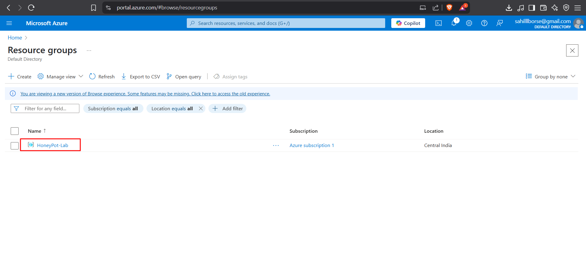
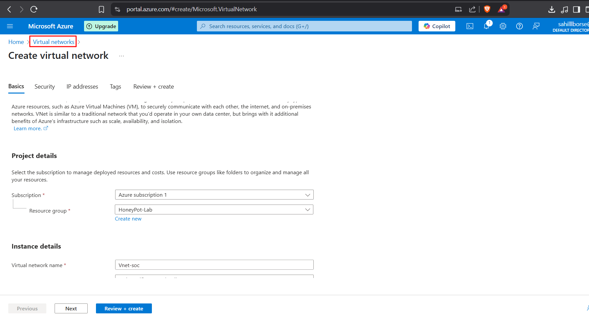
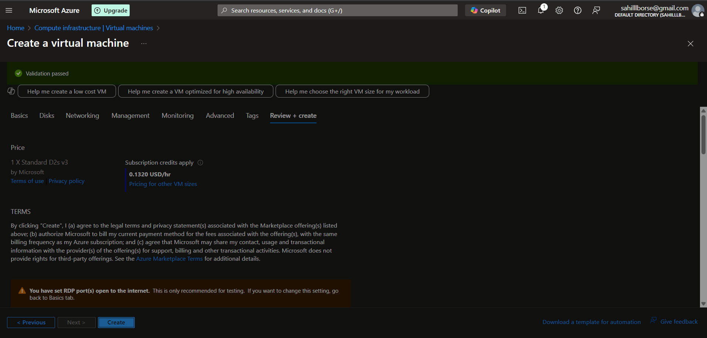
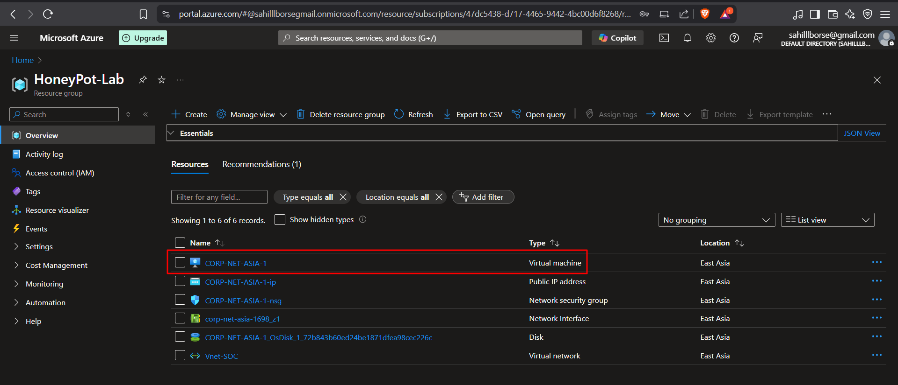
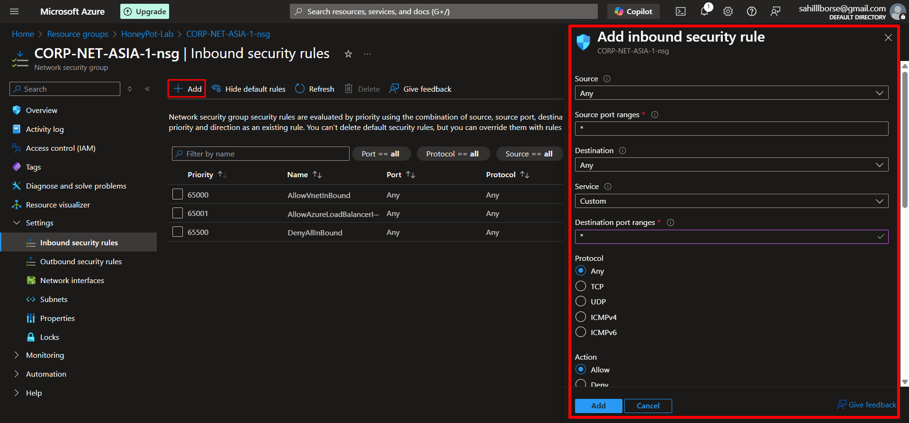

# Cybersecurity Home Lab: Detecting Attackers with Azure and Microsoft Sentinel

## Overview
This project demonstrates a cybersecurity home lab to detect real-world cyber attacks using a honeypot virtual machine (VM) in Microsoft Azure, Log Analytics Workspace, and Microsoft Sentinel. The lab captures failed RDP login attempts, parses them with a PowerShell script, and visualizes attacker geolocations on a world map.
This lab provides me hands-on experience with cloud security, SIEM tools, PowerShell scripting, and Kusto Query Language (KQL).

## Project Steps
1. Create a Resource Group

   • Created a Resource Group named “HoneyPot-Lab” in Azure to organize lab resources. 
   
   • Selected region: Central India

   Scrrenshot: 

2. Create Virtual Network

    
    .png)

3. Next, create the honeypot virtual machine to catch attackers

    
    

4. Edit the Network Security Group (NSG) for this VM so that its open to the public internet and is easily discovered by attackers
   
   Create a new inbound rule that allows any traffic from any source to any destination
   
   
   .png)

5. Next, Log into the vm via RDP and disable or turn off the windows firewall (start -> wf.msc -> properties -> all off)

   
